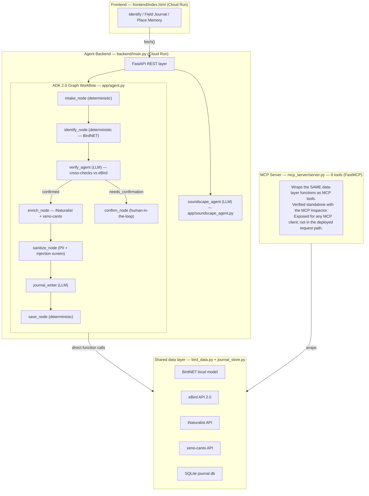

# BirdSong Bridge 🐦🎵

**A memory journal for a journey — record a bird call, and a small team of agents identifies it, cross-checks the ID against what's actually been seen nearby, writes you a field-journal entry, and turns a place's birds into a poetic soundscape brief.**

Built for the Kaggle *AI Agents: Intensive Vibe Coding* Capstone — **Agents for Good** track.

Merlin can identify a bird. BirdSong Bridge helps you **remember** one — where you were, what it meant, whether it's a species in trouble, and what it might sound like set to music.

---

## The problem

Acoustic bird-ID apps exist, but almost all of them make the same quiet mistake: they treat a classifier's raw confidence score as the final answer. A high score can't tell *"the model is right and this is a genuinely exciting find"* apart from *"the model confused two acoustically similar species."* That distinction matters most exactly when it's hardest to check by hand — in the field, in a place you don't know well, hearing something you've never heard before.

And even when the ID is right, identifying isn't *remembering*. BirdSong Bridge is built to make the identification honest enough to trust, then keep the moment — organised by place, understood in its conservation context, and turnable into music.

It's deliberately **not** region-specific: BirdNET covers 6,000+ species globally, and every other data source (eBird, iNaturalist, xeno-canto) is queried by coordinates, not by country.

## Why this helps — conservation through attention (Agents for Good)

People protect what they notice. BirdSong Bridge is built to grow that attention and put it in context:

- **Conservation status, surfaced in the moment** — every identification pulls the species' status from iNaturalist, and the Field Journal keeps a running count of near-threatened species heard across a trip.
- **Useful where field guides are thinnest** — the biodiversity hotspots with the richest birdsong and the least accessible reference material; coordinate-based, globally, not just North America and Europe.
- **Built on biodiversity citizen science** — plausibility is checked against eBird, one of the largest open biodiversity datasets. *Roadmap:* contribute confirmed sightings back to eBird / iNaturalist so a personal tool becomes a source of open data (today the journal is local).

## Why agents, specifically

A fixed-threshold `if confidence > 0.8, auto-accept` rule can't reason about plausibility — it has no way to know a candidate species has never been recorded within 25 km of where you're standing. An agent that can call a regional-checklist tool and weigh that against the raw acoustic score can. That's why `verify_agent` exists as a distinct node rather than a `confidence > X` if-statement (see `app/agent.py`).

## Architecture



**The hands and the brains.** The **data layer** (`bird_data.py`, `journal_store.py`) is the only code that touches BirdNET / eBird / iNaturalist / xeno-canto / SQLite. The **MCP server** (`mcp_server/server.py`) wraps that same layer as eight MCP tools and was verified independently with the **MCP Inspector** — this is the "MCP Server" concept demonstrated in code. The **ADK graph** (`app/agent.py`) does all the LLM reasoning.

**Honest note on the deployed path:** in the live app, the ADK graph calls the shared data-layer functions **directly** rather than over an in-cluster MCP network hop — a reliability choice that keeps the deployment to a single resilient service. The same tool surface is therefore exercised two ways: as a true MCP server (Inspector / external clients) and programmatically inside the graph. The data layer never reasons; the graph never reaches an external API except through that shared surface.

## Project layout

```
birdsong-bridge/
├── app/                     # the "brains" — ADK 2.0 graph workflow
│   ├── agent.py             # identify_workflow + confirm_workflow
│   ├── soundscape_agent.py  # Place Memory soundscape brief (LLM)
│   ├── security.py          # PII redaction + prompt-injection screening
│   ├── bird_data.py         # BirdNET / eBird / iNaturalist / xeno-canto wrappers
│   └── journal_store.py     # SQLite persistence
├── mcp_server/              # the "hands" — MCP server over the data layer
│   ├── server.py            # 8 MCP tools (FastMCP), Inspector-verified
│   ├── journal_store.py
│   └── requirements.txt
├── backend/                 # FastAPI REST layer wrapping the ADK Runner
│   ├── main.py
│   ├── Dockerfile
│   └── requirements.txt
├── frontend/
│   ├── index.html
│   ├── assets/
│   └── Dockerfile
├── tests/                   # test_security.py — no network / no keys needed
├── docs/
│   └── STRIDE_THREAT_MODEL.md
├── .semgrep/rules.yaml      # custom rule: catch hardcoded API keys
├── .pre-commit-config.yaml
├── deploy.ps1
├── cloudbuild.yaml
├── .env.example
└── README.md
```

## Quickstart (local)

```bash
# 1. API keys (all free — see "API keys" below)
cp .env.example .env        # fill in your keys

# 2. Agent backend  (loads .env automatically)
cd backend && pip install -r requirements.txt
uvicorn main:api --port 8080          # -> http://localhost:8080

# 3. Frontend (any static server)
cd frontend && python -m http.server 5500
# open http://localhost:5500
```

**Optional — run the MCP server standalone (the Inspector demo):**
```bash
cd mcp_server && pip install -r requirements.txt
python server.py                       # -> http://localhost:8000/mcp
npx @modelcontextprotocol/inspector    # connect, call a tool, see real data
```

Run `pytest tests/ -v` any time — the security module is fully unit-tested and needs no network or keys.

> **Windows note:** run the backend from the project root or the `backend/` folder with `uvicorn main:api --port 8080`. Keys are read from `.env` via `python-dotenv` — no need to export them each time.

## API keys

Every key is free.

| Key | Cost | Where |
|---|---|---|
| `GOOGLE_API_KEY` | Free (Flash / Flash-Lite tier) | aistudio.google.com/apikey |
| `EBIRD_API_KEY` | Free | ebird.org/api/keygen |
| `XENO_CANTO_API_KEY` | Free | xeno-canto.org account page |
| iNaturalist | No key (read-only lookups) | — |
| BirdNET | No key — runs locally | — |

No API keys are ever in code — everything is read from environment variables, with `.env` git-ignored.

## Security

See `docs/STRIDE_THREAT_MODEL.md`. Short version: user-submitted notes pass through `app/security.py`'s `sanitize_user_notes()` — PII redaction and prompt-injection screening — as its own graph node, *before* that text ever reaches an LLM prompt, mirroring the course's "shift security left" pattern. A pre-commit hook with a custom Semgrep rule blocks hardcoded API keys at commit time.

## Roadmap

Place Memory currently produces a **soundscape brief** — a score a musician (or a music model) can compose from — not generated audio. The brief has been validated by hand against a music-generation model; wiring that generation step directly into the app is the next milestone. Contributing confirmed sightings back to eBird / iNaturalist is the other.

## License & attribution

BirdNET models: CC BY-NC-SA 4.0 (Cornell Lab of Ornithology / Chemnitz University of Technology). eBird, iNaturalist, and xeno-canto data used under each service's API terms.
